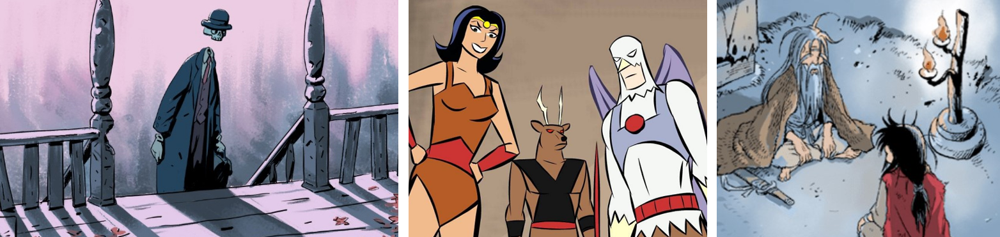

```{r setup, include=FALSE}
library(tidyverse)
library(tidymodels)
library(ggplot2)
library(janitor)
library(splitstackshape)
library(randomForest)
library(ggpubr)
library(ggmosaic)
# library(tune)
library(rpart.plot)
library(forcats)
library(gridExtra)
library(kknn)
library(yardstick)
options(warn=-1)
```


# Introduction 
## What are Webtoons?
Webtoons are a type of digital comic from South Korea designed for vertical scrolling on computers and mobile devices. They are often published in full color and may feature music and animations. For the purposes of this project, we will be specifically looking at the comics on Naver Webtoon.


<center>

{width="296"}

</center>

Webtoons Originals, which for the sake of brevity we will refer to as "webtoons," first start on the Discover section of the platform. Anyone can upload to Discover; once a comic is discovered by Webtoon's editors and the artist agrees to a contract, it will move to the Originals.

## Webtoon Styles

This project aims to find a connection between a webtoon's art style and variables such as its performance (such as likes and views), genre, and upload schedule.

To give some background on the various art styles creators use, I've divided each webtoon into one of several styles:

## Standard
<center>

{width="120"}

</center>
(!! INCLUDE ANOTHER EXAMPLE WITHOUT A MUSCULAR BODY)
This style is generally faithful or inspired by anime, employing cell shading and sharp but still dainty features. Notice in the example how the face is idealized (notably with a slim jaw) and typical of a "flower boy," in direct opposition with his muscles. Often these employ a realistic color palette and struggle to portray the older characters as truly old.

## Simplified Cartoon
<center>

{width="120"}

</center>

The simplified cartoon/comic style covers art styles that mimic that of TV animation. They often simplify their characters into highly readable shapes and use a wider variety of line weights than the standard style does. Many also include brighter and wackier color palettes, as well as textured brushes.

## Realistic Standard
<center>

{width="120"}

</center>

This style is in between the standard and American styles in that it generally includes fingernails, nostrils, blunter jaws, teeth, gums, etc. There are more variations in nose shapes and a tendency to have smaller, more proportionate eyes. 

## American
<center>

{width="620"}

This style gives its characters stronger jaws, strong shading, and intense black shadows. It doesn't shy away from showing wrinkles, fingernails, and other details usually absent from standard styles. Many also use textured brushes, as in the first example, or thick, tapered, and vary line weights and a desaturated blue to highlight black hair, as in the second. 

Overall, the clearest market of this style is heavy employment of black. The last example is not your classic Western superhero comic, but I've included it in this style because it employs its conventions regardless. _Note that my use of 'American' does not indicate the country of origin._


## Korean Realism
<center>

{width="120"}
{width="120"}

</center>

This style differs from the realistic standard style in that its realism focus often comes from its volumetric skin shading (often done with an airbrush or multiple low opacity brush strokes). The skin shading usually highlights bone structure, lips (including the men!), and the body in a "fleshy" way that appeals to an East Asian audience. Like the standard style, you will often see a delicate face on a muscular body. 

With Korean realism, if there is no volumetric skin shading, there will still be a clear emphasis on or intense effort put in illustrating everyone in an attractive way. For that reason, I nearly named this style "Korean idealism" (but did not because it brings a new set of connotations.) I have kept "Korean" in the style name because we are dealing with a medium that originated in Korea. As far as the other major East Asian countries go, in general, the "Japanese" and "Chinese" styles are more in line with the standard category. For the sake of this project I will not splinter the standard style any further.

# Loading Data
For this project, we will be working with data from the English platform of Naver Webtoon. The file is from Kaggle: https://www.kaggle.com/datasets/iridazzle/webtoon-originals-datasets.

Webtoons do not come with information on their art style or their author's country of origin, so I had to manually input them. 

The raw file contains data on the genre, authors, weekdays uploaded, number of free episodes, subscriber count, views, likes, upload status, and the synopsis:
```{r }
rawdata <- read.csv('webtoon_originals_en.csv')
```
```{r class.source = 'fold-show'}
head(rawdata)
```

Before we can proceed, we will need to clean and unstack some of the columns.

# Data Cleaning

Here are the steps I took to prepare the data.

* Cleaning the names

```{r }
webtoons <- rawdata %>%
  clean_names()
```

* Adding a new variable called `synopsis_length` to quantify the `synopsis`, since I'm curious if it will make an impact
```{r , results = 'hide'}
webtoons <- webtoons %>%
  mutate(synopsis_length = str_count(synopsis)) 
```

* Dropping unhelpful variables, such as `title_id`
```{r , results = 'hide'}
webtoons <- webtoons%>%
  select(-c(authors, title_id, synopsis))
```

* Renaming the length column to the more descriptive 'free_episodes' to avoid confusion:
```{r }
webtoons <- webtoons %>%
  rename(free_episodes = length)
```

# Exploratory Data Analysis

Naver first began publishing webtoons in 2004 and started offering English translations of its most popular comics in 2014. Thus, I expect its general audience to skew towards a younger demographic, giving rise to an uneven genre distribution (though I'm sure it'd be uneven regardless, since people obviously have varying tastes). Let's take a look:
```{r }
webtoons %>%
  group_by(genre) %>%
  summarise(count = n()) %>%
  ggplot(aes(x = reorder(genre, (-count)), y = count)) +
  geom_bar(stat = 'identity') + 
  coord_flip() + 
  labs(y = 'Count', x = 'Genre')
```

The two dominating categories, fantasy and romance, have broad appeal. This is not too surprising. We must also remember that a single webtoon may encompass more than one genre.

One of the least popular genres is called a "Tiptoon." These are informative webtoons that the platform  sometimes asks its creators to illustrate, giving tips on subjects such as how to stay healthy during the pandemic and how to edit your webtoon. As they are not a regular fictive comic, we will drop the genre.

```{r}
webtoons <- subset(webtoons, genre != 'TIPTOON')
```

I also suspect budding authors to look at the synopses of established creators in their genres as inspiration. Let's see if synopsis lengths are generally similar within their genres.
```{r }
webtoons %>%
  ggplot(aes(x=reorder(genre, synopsis_length), y=synopsis_length)) + 
  geom_boxplot() +
  coord_flip() + labs(title = 'Plot of synopsis length by genre',
               y = 'synopsis length (words)',
               x = 'genre')
```

Since we do see increasing fundamental differences in median `synopsis_length`, we will retain it for our models.

Now let's look at the distribution of our outcome variable, `style`.

```{r }
bp2_count <- plyr::count(webtoons$style)

webtoons$style <- factor(webtoons$style, 
  levels = bp2_count$x[order(bp2_count$freq, decreasing = TRUE)])

ggplot(data = webtoons, aes(x = style)) +
  geom_bar() + 
  coord_flip() + 
  labs(title = 'Frequency of each style', y = 'Count', x = 'style')

```

Not surprisingly, most webtoons are of the standard style, with deviations from it becoming less common.

Next we will explore each genre's popularity. Webtoons offers four metrics to judge this: `rating`, on a scaled of 1 to 10 (with steps of 0.5), `likes`, `views`, and `subscribers`.

```{r}
likes_lab <- c('Am', 'r', 'ct', 's', 'Kor') 
likes_plot <- ggplot(webtoons, aes(reorder(style, likes), likes)) +
  geom_boxplot(varwidth = TRUE) + 
  labs(
    title = "Likes by Style",
    x = "Style"
  ) + coord_trans(x = 'log2', y = 'log2') + scale_x_discrete(labels = likes_lab)

views_lab <- c('Am', 'r', 'ct', 's', 'Kor')
views_plot <- ggplot(webtoons, aes(reorder(style, views), views)) +
  geom_boxplot(varwidth = TRUE) + 
  labs(
    title = "Views by Style",
    x = "Style"
  ) + coord_trans(x = 'log2', y = 'log2')  + scale_x_discrete(labels = views_lab)

subs_lab <- c('Am', 'ct', 'r', 's', 'Kor')
subs_plot <- ggplot(webtoons, aes(reorder(style, subscribers), subscribers)) +
  geom_boxplot(varwidth = TRUE) + 
  labs(
    title = "Subscribers by Style",
    x = "Style"
  ) + coord_trans(x = 'log2', y = 'log2') + scale_x_discrete(labels = subs_lab)

rating_lab <- c('Am', 'ct', 'r', 'Kor', 's')
rating_plot <- ggplot(webtoons, aes(reorder(style, rating), rating)) +
  geom_boxplot(varwidth = TRUE) + 
  labs(
    title = "Rating by Style",
    x = "Style"
  ) + coord_trans(x = 'log2', y = 'log2') +
  scale_x_discrete(labels = rating_lab)
```

```{r}
full_name <- data.frame(abb =c('Am','ct','r', 's', 'Kor'),fname = c('American','cartoon','realistic standard', 'standard', 'Korean realism'))


square_plot <- ggarrange(likes_plot, views_plot, subs_plot, rating_plot,
          ncol = 2, nrow = 2) +
  theme(axis.text.x = element_text(angle = 90, hjust = 1))

grid.arrange(square_plot, tableGrob(full_name, rows = NULL), nrow = 1, widths = c(3, 1))
```
Interestingly, the American style consistently ranks the lowest, while the others all swap order at some point. Realistic standard and cartoon at fourth and third lowest, and Korean realism and standard compete for first place.

Readers may prefer a more Asian style. This should not come as a surprise since Webtoons is a Korean platform and may be more well known to those within an Asian sphere.


```{r, warning = FALSE}
ggplot(webtoons, aes(reorder(style, free_episodes), free_episodes)) +
  geom_boxplot(varwidth = TRUE) + 
  labs(
    title = 'Style by Number of Free Episodes',
    x = 'Style'
  ) 
```
Again, the styles with the most departure from the standard styles—cartoon and American—stand out the most. The American style has a much lower potential ceiling than the rest in terms of free episodes, and the cartoon style has a higher median than every other style's 75th percentiles. 

Let's see if we can make any other obvious distinctions between styles by comparing each genre's composition.
```{r, warning = 'FALSE'}
webtoons %>%
  mutate(genre = forcats::fct_infreq(genre)) %>%
ggplot() + 
  geom_mosaic(aes(x=product(style, genre), fill = style),
              divider=c('vspine', 'hbar')) +   coord_flip() + 
  labs(x='genre', y = 'style', title = 'Stacked Bar Chart') + theme(axis.text.x = element_blank(),
axis.ticks.x = element_blank())
```

Surprisingly, while the American style makes up most of the superhero genre, the superhero genre does not appear to make up most of the American style comics.

We can also see that the bulk of the cartoon styles are in the slice of life and the comedy comics. Hence cartoon is the only style that overwhelmingly dominates any single genre.

Now that we've explored the data, here is an overview of the cleaned variables that we will be looking at:

* `title`: webtoon title
* `style`: the art style (American, cartoon, standard, realistic standard, or Korean realism)
* `free_episodes`: the number of free episodes available 
* `subscribers`: the number of subscribers
* `rating`: the rating out of 10, with 10 being the best and measured in steps of 0.5
* `views`: total accumulated views
* `likes`: total accumulated likes from all available episodes
* `synopsis_length`: word count in the webtoon's synopsis
* `daily_pass`: whether or not the webtoon is limited to one free episode per day 
	1: True
	0: False
*`sunday`, `monday`, ..., `saturday`: whether or not the webtoon is updated on that particular day
	1: True
	0: False
* `action`, `comedy`, `drama`, ... `supernatural`, `thriller`: whether or not the webtoon is that specific genre
	1: True
	0: False
* `english`, `korean`, `japanese`, `indonesian`: whether or not the webtoon originated from that specific language platform
	1: True
	0: False
* `ongoing`, `completed`, `hiatus`: whether or not the webtoon's status is currently continuing, finished, or on a break
	1: True
	0: False

_The list above is also available in the codebook._

# Dummy coding

Quite a few of the variables are not numeric. Now that we've explored the data, we will now unpack the categorical variables into more specific ones.

Let's parse `status`, `original_platform`, `genre`, and the days of the week variables into boolean columns.

* `status`
```{r, results='hide'}
webtoons <- webtoons %>%
  mutate(n = 1) %>%
  pivot_wider(names_from = status, values_from = n, values_fill = list(n = 0))
```

* `original_platform`
```{r, results='hide'}
webtoons <- webtoons %>%
  mutate(n = 1) %>%
  pivot_wider(names_from = original_platform, values_from = n, values_fill = list(n = 0))
```

* `genre`
```{r, results='hide'}
webtoons <- webtoons %>%
  mutate(n = 1) %>%
  pivot_wider(names_from = genre, values_from = n, values_fill = list(n = 0))

# Lowercase all column names
names(webtoons) <- tolower(names(webtoons))
```

* days of the week
```{r, results='hide'}
webtoons <- cSplit_e(webtoons, 'weekdays', sep = ',', mode = 'binary',
         type = 'character', fill = 0, drop = TRUE)

# renaming
colnames(webtoons)[colnames(webtoons) == 'weekdays_SUNDAY'] <- 'sunday'
colnames(webtoons)[colnames(webtoons) == 'weekdays_MONDAY'] <- 'monday'
colnames(webtoons)[colnames(webtoons) == 'weekdays_TUESDAY'] <- 'tuesday'
colnames(webtoons)[colnames(webtoons) == 'weekdays_WEDNESDAY'] <- 'wednesday'
colnames(webtoons)[colnames(webtoons) == 'weekdays_THURSDAY'] <- 'thursday'
colnames(webtoons)[colnames(webtoons) == 'weekdays_FRIDAY'] <- 'friday'
colnames(webtoons)[colnames(webtoons) == 'weekdays_SATURDAY'] <- 'saturday'
```

* `daily_pass`

```{r}
webtoons$daily_pass <- ifelse(webtoons$daily_pass == TRUE, 1, 0)
```

# Factors
Now we will convert our categorial variables into factors.

* `style` and `daily_pass`
```{r }
webtoons$style <- as.factor(webtoons$style)
webtoons$daily_pass <- as.factor(webtoons$daily_pass)
```

* platforms
```{r }
webtoons$english <- as.factor(webtoons$english)
webtoons$korean <- as.factor(webtoons$korean)
webtoons$japanese <- as.factor(webtoons$japanese)
webtoons$indonesian <- as.factor(webtoons$indonesian)
```

* genres
```{r }
webtoons$action <- as.factor(webtoons$action)
webtoons$comedy <- as.factor(webtoons$comedy)
webtoons$drama <- as.factor(webtoons$drama)
webtoons$fantasy <- as.factor(webtoons$fantasy)
webtoons$heartwarming <- as.factor(webtoons$heartwarming)
webtoons$historical <- as.factor(webtoons$historical)
webtoons$horror <- as.factor(webtoons$horror)
webtoons$mystery <- as.factor(webtoons$mystery)
webtoons$romance <- as.factor(webtoons$romance)
webtoons$slice_of_life <- as.factor(webtoons$slice_of_life)
webtoons$scifi <- as.factor(webtoons$scifi)
webtoons$sports <- as.factor(webtoons$sports)
webtoons$super_hero <- as.factor(webtoons$super_hero)
webtoons$supernatural <- as.factor(webtoons$supernatural)
webtoons$thriller <- as.factor(webtoons$thriller)
```

* statuses
```{r}
webtoons$ongoing <- as.factor(webtoons$ongoing)
webtoons$completed <- as.factor(webtoons$completed)
webtoons$hiatus <- as.factor(webtoons$hiatus)
```

* days of the week
```{r}
webtoons$monday <- as.factor(webtoons$monday)
webtoons$tuesday <- as.factor(webtoons$tuesday)
webtoons$tuesday <- as.factor(webtoons$tuesday)
webtoons$wednesday <- as.factor(webtoons$wednesday)
webtoons$thursday <- as.factor(webtoons$thursday)
webtoons$friday <- as.factor(webtoons$friday)
webtoons$saturday <- as.factor(webtoons$saturday)
webtoons$sunday <- as.factor(webtoons$sunday)
```


# Model setup

## Data Split

We will allocate 80% of the data to the training set and 20% to the testing set.
```{r}
set.seed(66)
w_split <- initial_split(webtoons, prop = 0.8, strata = 'style')
w_train <- training(w_split)
w_test <- testing(w_split)
```

```{r}
# Here I will check that the data are split in correct percentages.
dim(w_train)
```

```{r}
dim(w_test)
```

```{r}
dim(webtoons)
```

## Folding data
Now we will perform v-fold cross validation with 10 folds, stratifying by `style`.
```{r class.source = 'fold-show'}
w_folds <- vfold_cv(data = w_train, v = 10, strata = 'style')
```

## Recipe
Setting up recipe to predict `style` by dummy coding all nominal variables and by normalizing all predictors:
```{r class.source = 'fold-show'}
w_recipe <- recipe(style ~ rating + views  + daily_pass + free_episodes  + likes + subscribers + synopsis_length + monday + tuesday + wednesday + thursday + friday + saturday + sunday + ongoing + completed + hiatus + english + korean + japanese + indonesian + action + comedy + drama + fantasy + heartwarming + historical + horror + mystery + romance + scifi + slice_of_life + sports + super_hero + supernatural + thriller,
                   data = w_train) %>%
  step_dummy(c(daily_pass, monday, tuesday, wednesday, thursday, friday, saturday, sunday, ongoing, completed, hiatus, english, korean, japanese, indonesian, action, comedy, drama, fantasy, heartwarming, historical, horror, mystery, romance, scifi, slice_of_life, sports, super_hero, supernatural, thriller)) %>%
  step_normalize(all_predictors())
```

# Modeling

I decided to run the following models thanks to my dataset being dominated by categorical variables:

* multinomial logistic regression
* random forest
* boosted trees
* decision tree
* nearest neighbors

### Multinomial logistic regression

We will tune `penalty` and `mixture`. Since our outcome is `style`, `mode` is set to `classification`.
```{r class.source = 'fold-show'}
multinom_mod <- multinom_reg(penalty = tune(),
                        mixture = tune()) %>%
  set_engine('glmnet') %>%
  set_mode('classification')
```

Next, we combine the model and recipe into a workflow.
```{r class.source = 'fold-show'}
multinom_wkflow = workflow() %>%
  add_model(multinom_mod) %>%
  add_recipe(w_recipe)
```

Now we'll define the tuning grid and finally tune the model. We'll select the best performing model based on the area under the ROC curve.
```{r class.source = 'fold-show'}
multinom_grid = grid_regular(penalty(range = c(-5, 5)),
                       mixture(range = c(0, 1)),
                       levels = 10)

multinom_tune <- tune_grid(object = multinom_wkflow,
                        resamples = w_folds,
                        grid = multinom_grid)
result_multinom <- multinom_tune %>%
  collect_metrics() %>% 
  arrange(desc(mean)) %>%
  filter(row_number()==1)

result_multinom
```

```{r}
load(file='./data/tuned_models/tune_multinom.rda')
autoplot(multinom_tune)
```

## Random forest
```{r class.source = 'fold-show'}
rf_mod <-
  rand_forest(min_n = tune(), mtry = tune()) %>%
  set_mode('classification') %>%
  set_engine('randomForest')

rf_wkflow <- workflow() %>%
  add_model(rf_mod) %>%
  add_recipe(w_recipe)

rf_grid <- grid_regular(min_n(),
                        mtry(range = c(1, 35)),
                        levels = 3) 

tune_rf <- rf_wkflow %>%
  tune_grid(resamples = w_folds,
    grid = rf_grid)

# save(tune_rf, rf_wkflow, 
#      file='./data/tuned_models/tune_rf.rda')

# load(file='./data/tuned_models/tune_rf.rda')

result_rf <- tune_rf %>%
  collect_metrics() %>% 
  arrange(desc(mean)) %>%
  filter(row_number()==1)

result_rf
```

# Boosted trees

Here we specify the tuning parameter `tree` and set the engine to `xgboost` beforestoring the recipe in a workflow:

```{r class.source = 'fold-show'}
boost_mod <- boost_tree(trees = tune()) %>%
  set_engine('xgboost') %>%
  set_mode('classification')

boost_wkflow <- workflow() %>%
  add_model(boost_mod) %>%
  add_recipe(w_recipe)
```

I set the upper limit for the 
```{r class.source = 'fold-show'}
boost_grid <- grid_regular(trees(c(100, 1000)),
                           levels = 5)

tune_boost <- tune_grid(
  boost_wkflow,
  resamples = w_folds,
  grid = boost_grid
)

# save(tune_boost, boost_wkflow, file='./data/tuned_models/tune_boost.rda')
```

```{r class.source = 'fold-show'}
# load(file='./data/tuned_models/tune_boost.rda')
autoplot(tune_boost)

result_boost <- tune_boost %>% 
  collect_metrics() %>% 
  arrange(desc(mean)) %>%
  filter(row_number()==1)

result_boost
```

# Decision tree

We will now prepare to fit the decision tree model in a similar fashion.

Putting together the recipe, dummy coding the nominal variables, and normalizing all predictors:

```{r class.source = 'fold-show'}
dt_recipe <- recipe(style ~ rating + views  + daily_pass + free_episodes  + likes + subscribers + synopsis_length + monday + tuesday + wednesday + thursday + friday + saturday + sunday + ongoing + completed + hiatus + english + korean + indonesian + action + comedy + drama + fantasy + heartwarming + historical + horror + mystery + romance + scifi + slice_of_life + sports + super_hero + supernatural + thriller,
                   data = w_train) %>%
  step_dummy(c(daily_pass, monday, tuesday, wednesday, thursday, friday, saturday, sunday, ongoing, completed, hiatus, english, korean, indonesian, action, comedy, drama, fantasy, heartwarming, historical, horror, mystery, romance, scifi, slice_of_life, sports, super_hero, supernatural, thriller)) %>%
  step_normalize(all_predictors())


```

Setting up the model, the workflow, and the tuning grid:

```{r class.source = 'fold-show'}
dt_mod <- decision_tree(
  cost_complexity = tune(),
  tree_depth = tune(), min_n = tune()) %>%
  set_engine('rpart') %>% 
  set_mode('classification')

dt_wkflow <- workflow() %>% 
                 add_model(dt_mod) %>% 
                 add_recipe(w_recipe)

dt_grid <- grid_regular(cost_complexity(),
                          tree_depth(),
                          min_n(), 
                          levels = 3)
```

Finally, we fit the decision tree:
```{r class.source = 'fold-show'}
tune_dt <- dt_wkflow %>%
               tune_grid(resamples = w_folds,
                         grid = dt_grid)
tune_dt %>% show_best('roc_auc')
```

```{r class.source = 'fold-show'}
dt_best <- tune_dt %>%
  select_best(metric = 'roc_auc')
final_dt_workflow <- dt_wkflow %>% 
                       finalize_workflow(dt_best)

dt_wf_fit <- final_dt_workflow %>% 
               fit(data = w_train)

tree_fit <- dt_wf_fit %>% 
            pull_workflow_fit()

rpart.plot(tree_fit$fit, roundint = FALSE)
```


```{r class.source = 'fold-show'}

tree_last_fit <- final_dt_workflow %>% 
                 last_fit(w_split)


tree_predictions <- tree_last_fit %>% collect_predictions()

result_dt <- arrange(
  collect_metrics(tune_dt),
  desc(mean)) %>%
  filter(row_number()==1)
result_dt
```
```{r}
dt_accuracy <- augment(dt_wf_fit, new_data = w_train) %>%
  accuracy(truth = style, estimate = .pred_class)
dt_accuracy
```

A heatmap of our results shows that the decision tree had quite a bit of trouble separating the standard style from the Korean realism style with the given predictors. The model failed to correctly recognize _any_ of the Korean realism-style webtoons, for that matter.


```{r}
conf_mat(tree_predictions, truth = style, estimate = .pred_class) %>%   autoplot(type = "heatmap") +
  scale_x_discrete(limits = rev) +
  scale_y_discrete(limits = rev)
```
65.5% of the standard, 42.9% of the realistic standard, 40.0% of the cartoon, and 26.3% of the American styles were predicted correctly. 
# Nearest Neighbors

```{r class.source = 'fold-show', warning = FALSE}
knn_mod <- 
  nearest_neighbor(
    neighbors = tune(),
    mode = 'classification') %>% 
  set_engine('kknn')

knn_wkflow <- workflow() %>% 
  add_model(knn_mod) %>% 
  add_recipe(w_recipe) 

knn_params <- parameters(knn_mod)

knn_grid <- grid_regular(knn_params, levels = 2)

tune_knn <- knn_wkflow %>%
  tune_grid(resamples = w_folds,
            grid = knn_grid)


# save(tune_knn, knn_wkflow, file = "data/tuned_models/tune_knn.rda")
```

```{r class.source = 'fold-show'}
load(file='./data/tuned_models/tune_knn.rda')

result_knn <-arrange(collect_metrics(tune_knn),
                     desc(mean)) %>% 
  select(-.estimator, -.config) %>%
  filter(row_number()==1)

result_knn


best_complexity <- select_best(tune_knn, metric = "roc_auc")

knn_final <- finalize_workflow(knn_wkflow, best_complexity)

knn_fit <- fit(knn_final,data = w_train)
augment(knn_fit, new_data = w_test) %>%
  accuracy(truth = style, estimate = .pred_class)

augment(knn_fit, new_data = w_test) %>%
  conf_mat(truth = style, estimate = .pred_class) %>%
  autoplot(type = "heatmap")+
  scale_x_discrete(limits = rev) +
  scale_y_discrete(limits = rev)
```


```{r}
result_lab <- c('multinom', 'rf', 'boost', 'dt', 'knn')

result_means <- c(result_multinom['mean'], result_rf['mean'], result_boost['mean'], result_dt['mean'], result_knn['mean'])

result_sd <- c(result_multinom['std_err'], result_rf['std_err'], result_boost['std_err'], result_dt['std_err'], result_knn['std_err'])

result_matrix <- matrix(c(result_means, result_sd), ncol = 2)

colnames(result_matrix) <- c('means', 'std_err')
rownames(result_matrix) <- result_lab

result_matrix
```

Overall, it looks like the multinomial model did the best.

# Evaluating the Best Model

Let's fit our trained logistic model to the test set and see how we did!

```{r class.source = 'fold-show'}
final_multinom_tune = multinom_tune %>%
  select_best("roc_auc")

final_multinom_wkflow = multinom_wkflow %>%
  finalize_workflow(final_multinom_tune)

final_multinom_fit = final_multinom_wkflow %>%
  fit(w_train)


predict_best = augment(final_multinom_fit, w_test)

final_accuracy <- accuracy(data=predict_best, truth=style,
        estimate=.pred_class)
final_accuracy
```


```{r}
acc_lab <- c('test', 'train')
acc_lab

acc <- c(final_accuracy['.estimate'], dt_accuracy['.estimate'])
acc

acc_matrix <- matrix(acc)

colnames(acc_matrix) <- 'accuracy'
rownames(acc_matrix) <- acc_lab

acc_matrix
```
The model actually performed slightly better on the training set, so I am concerned about overfitting (though it is not by much.) Let's take a look at how exactly it performed.

```{r}
conf_mat(predict_best, truth = style, estimate = .pred_class) %>%   autoplot(type = "heatmap") +
  scale_x_discrete(limits = rev) +
  scale_y_discrete(limits = rev)
```
Again, it looks like our model can't distinguish the Korean realism style at all. I find it interesting that the only time it even tried to predict it, it incorrectly guessed the standard style. 

Below is a table comparing how the testing predictions compare to the training ones.

```{r}
genre_lab <- c('standard', 'realistic standard', 'cartoon', 'American', 'Korean realism')

test_pred <- c(78.2, 34.3, 63.3, 36.8, 0.0)
train_pred <- c(65.5, 42.9, 40.0, 26.3, 0.0)

pred_matrix <- matrix(c(test_pred, train_pred), ncol = 2)
rownames(pred_matrix) <- genre_lab
colnames(pred_matrix) <- c('test (%)', 'train (%)')

pred_matrix
```

Considering that I manually inputted every single style before I wrote the rest of this project, knowing what I do now, I might recategorize several webtoons. I would have liked to include more variables such as brush texture, author age, existence of author(s)' social media, color palette, and panel length, but those are not available in Webtoons' API and would thus require ungodly hours of simply gathering data. Nonetheless I am still impressed by how the model performed with the information it had.